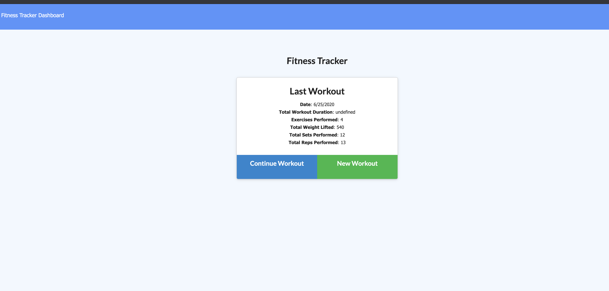
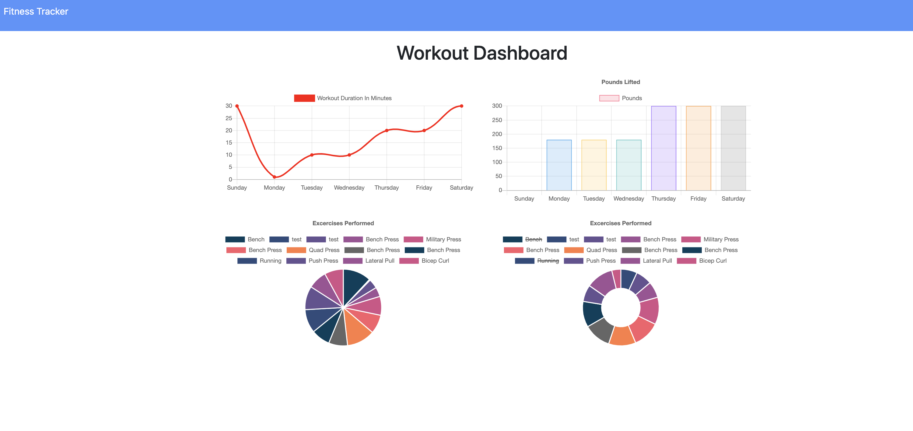
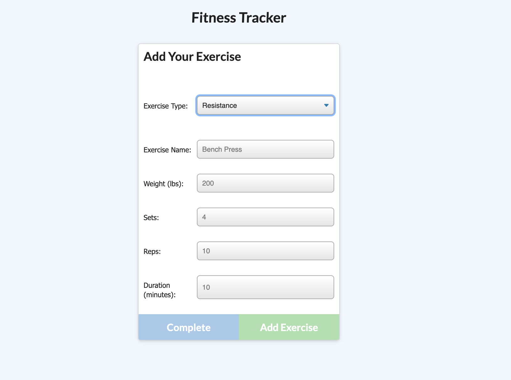
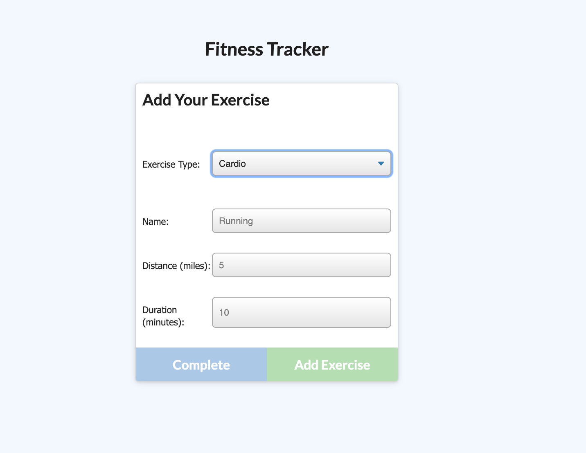

# Fitness_Tracker

## Description

This Fitness Application will track the user's exercise and the assoicated data in a Mongo database. It will populates with a seed file and can track the user over a period of time. 

Landing Page

Stats Page

Resitence Addition

Cardio Addition

## Current Version 

v1.0

## Table of Contents

    * Installation
    * Usage
    * License
    * Contributing
    * User GitHub profile picture
    * User GitHub email
                
## Installation

Check out the link: https://boiling-harbor-58994.herokuapp.com/

## Usage

This is open source. 

## License

Public domain  

## Contributing

## Questions
For questions, contact me with the information below. 

## Contact Information

https://github.com/truittj

